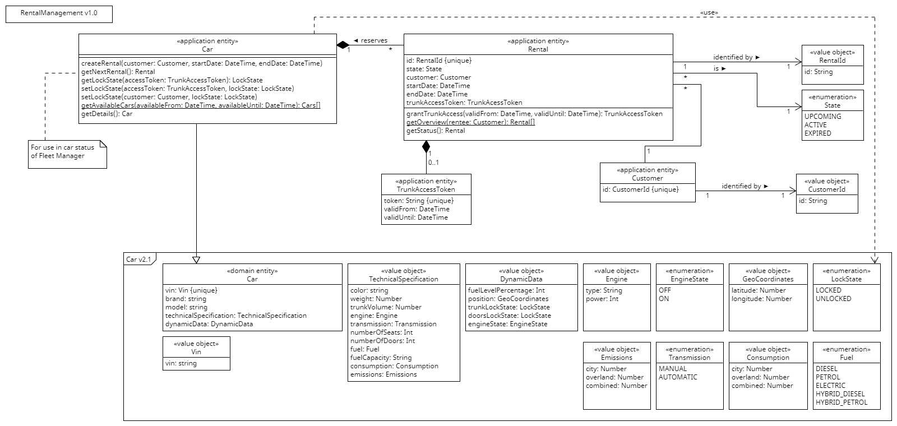

## API Diagram of RentalManagement
The API diagram displays the involved application entities and their relations to domain entities.

### `Car` Application Entity
The `Car` application entity extends the eponymous domain entity to enrich it with rental information.

### `Customer` Application Entity
The `Customer` application entity represents a person authorized to rent cars. It only consists of its identifier.

### `Rental` Application Entity
The `Rental` application entity contains the time period during which a customer rents a car. The 'active' indicator is derived from this period and the current timestamp.

### `TrunkAccessToken` Application Entity
The `TrunkAccessToken` application entity is a token that expresses a person's permission to open the trunk of the car while the corresponding rental is active.
